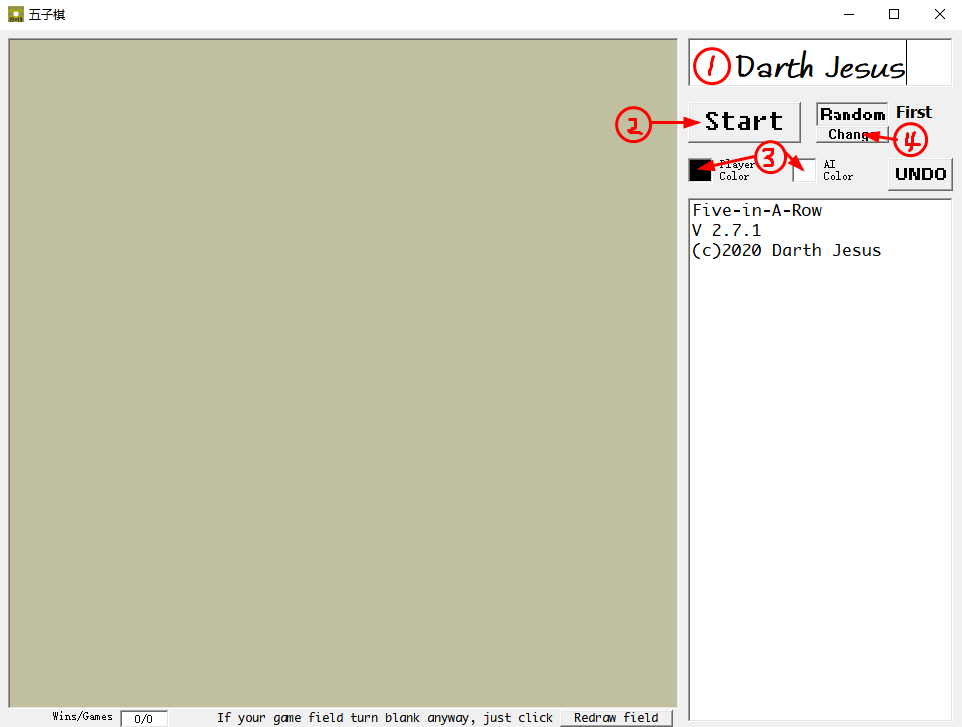
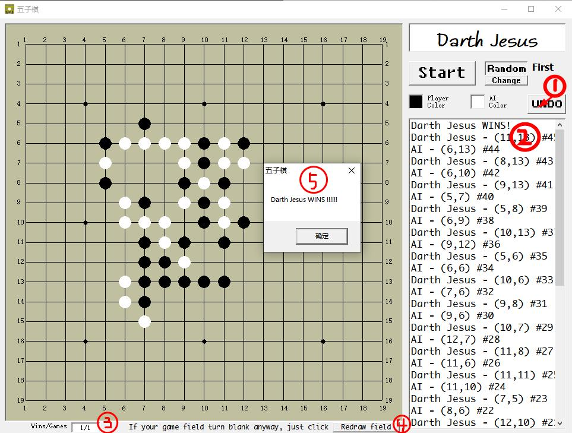

# **五子棋(Large field with AI)**
### 目前只提供Windows版本下载.
------
#### 下载
##### 建议下载
##### [`Windows, x86/x64 (setup)`](setup.exe)
##### 如果你有VB6.0，直接下载这个
##### [`Windows, x86/x64 (单个EXE)`](Five-In-A-Row v2.7.1.exe)
##### 源代码下载
##### [`VB6.0 Project 源代码`](https://github.com/DarthJesusYan/Five-In-A-Row)
------
#### 概观

1.  这里可以改成自己的名字.

2.  点击 [Start] 开始.

3.  点击此处改变颜色(随时).

4.  开始前, 点此处修改:[谁是先手?].

    ------

1.  点击 [UNDO] 撤回前一步(一轮只能用一次).
2.  这里记录了每一步.
3.  这里记录了胜场/总局数.
4.  如果窗口置于其他窗口底层而使画面变空白，点击此处重画.
5.  当一方获胜时，弹出对话框.