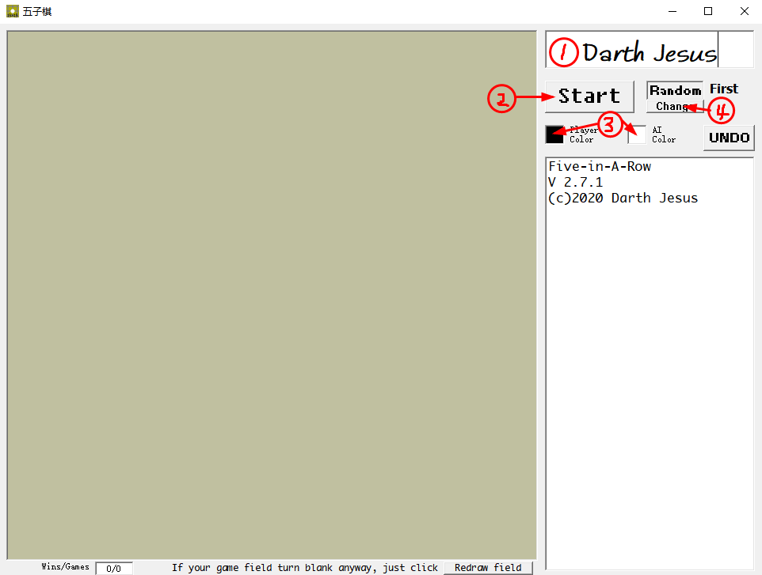

[中文版](cn.html)

# **Five-In-A-Row(Large field with AI)**
### Only for Windows for the time being.
------
#### Downloads
##### Suggested download
##### [`for Windows, x86/x64 (setup)`](setup.exe)
##### Download this if you have VB.
##### [`For windows, x86/x64 (Single exe)`](Five-In-A-Row v2.7.1.exe)
##### Download Source Code
##### [`VB Project source code`](https://github.com/DarthJesusYan/Five-In-A-Row)

------
#### Overview

1.  You can change the name to your name.

2.  Click [Start] to start game.

3.  Click to change color(at anytime).

4.  Before game starts, click to change:[Who first?].

    ------

1.  Click [UNDO] to undo 1 step(cannot be used twice at a time).
2.  Here records steps.
3.  Here records number of games and wins.
4.  If the window goes under another window and the field turns blank, just click to redraw.
5.  When one wins, dialog will jump out.